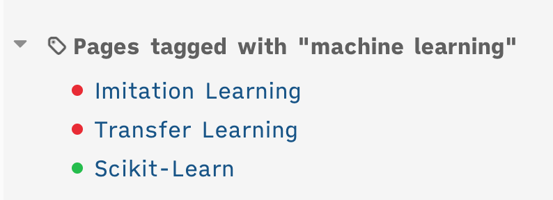

# Logseq Tag Organizer

it's simple, but helpful to organize tagged pages:

- when a tagged page is not included in this page, turn red
- when a tagged page is included in ths page, turn green
- The red pages will be positioned higher up, so you can focus on organizing them

## background

i usually take notes and simply put a tag, this plugin helps me to organize tagged pages later